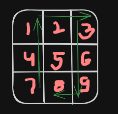

# Title: L2-Circular Traversal

## Problem Statement:

Given a square matrix, you have to find the reverse U traversal of the matrix. Refer the sample I/O for better understanding. Refer the given figure for better understanding.

### Note:

No element should be visited more than once.

